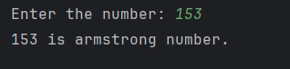

# Day 20 - Armstrong Number

## 📖 Description

This is my **Day 20** program for the **100 Days of Python** challenge.

The program accepts an integer from the user and checks whether it is an **Armstrong number**.

An Armstrong number is a number in which the sum of each digit raised to the power of the total number of digits is equal to the original number.

For example:

153 = 1³ + 5³ + 3³

153 = 1 + 125 + 27

153 = 153

Therefore, 153 is an Armstrong number.

---

## 💻 Program

    # Day 20 - Armstrong Number

    num = abs(int(input("Enter the number: ")))

    armstrong = 0
    original = num
    real = num
    number_of_digit = 0

    while num != 0:
        num = num // 10
        number_of_digit += 1

    if real == 0:
        number_of_digit = 1

    while original != 0:
        digit = original % 10
        armstrong = armstrong + digit ** number_of_digit
        original = original // 10

    if real == armstrong:
        print(f"{armstrong} is armstrong number.")
    else:
        print(f"{armstrong} it is not an armstrong number.")

---

## ▶️ Sample Output

---

## 📚 Concepts Practiced

- Variables
- User Input
- Type Conversion (`int()`)
- `abs()` Function
- `while` Loop
- Modulus Operator (`%`)
- Integer Division (`//`)
- Exponent Operator (`**`)
- Conditional Statements (`if`, `else`)
- Comparison Operators
- Counter Variables
- Accumulator Variables
- Number Digit Processing
- f-Strings
- `print()` Function

---

## 🎯 What I Learned

- How to check whether a number is an Armstrong number.
- How to count the number of digits using a `while` loop.
- How to extract individual digits using `% 10`.
- How to remove digits using `// 10`.
- How to raise each digit to the required power using `**`.
- How to calculate and compare the Armstrong value with the original number.
- How to preserve the original number while modifying another copy.
- How to handle `0` as a special case.
- How to solve the problem without converting the number to a string.

---

## 🔑 Important Technique

    digit = original % 10
    armstrong = armstrong + digit ** number_of_digit
    original = original // 10

These operations allow the program to extract each digit, raise it to the required power, add it to the Armstrong sum, and then remove the processed digit.

---

**Challenge:** 100 Days of Python  
**Day:** 20/100 ✅