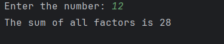

# Day 28 - Sum of All Factors

## 📖 Description

This is my **Day 28** program for the **100 Days of Python** challenge.

The program accepts an integer from the user and finds the **sum of all the factors** of that number.

A factor is a number that divides another number exactly without leaving a remainder.

For example, the factors of 12 are:

1, 2, 3, 4, 6, 12

Therefore:

1 + 2 + 3 + 4 + 6 + 12 = 36

---

## 💻 Program

```
# Day 28 - Sum of All Factors

num1 = abs(int(input("Enter the number: ")))

total = 0

if num1 == 0:
    total = 0
else:
    for i in range(1, num1 + 1):
        if num1 % i == 0:
            total += i

print(f"The sum of all factors is {total}")
```

---

## ▶️ Sample Output



---

## 📚 Concepts Practiced

* Variables
* User Input
* Type Conversion (`int()`)
* `abs()` Function
* `for` Loop
* `range()` Function
* Modulus Operator (`%`)
* Divisibility
* Conditional Statements
* `if` and `else`
* Comparison Operators
* Accumulator Variable
* Addition
* f-Strings
* `print()` Function

---

## 🎯 What I Learned

* How to find the factors of a number.
* How to calculate the sum of all factors.
* How to check divisibility using the modulus operator (`%`).
* How to use a `for` loop to check every possible factor.
* How to use an accumulator variable to store a running total.
* How to add each valid factor to the total.
* How to handle zero as an input.
* How to reuse the factor-checking logic from previous problems.

---

## 🔑 Important Technique

```
total = 0

for i in range(1, num1 + 1):
    if num1 % i == 0:
        total += i
```

The variable `total` acts as an **accumulator**.

Whenever a factor is found, it is added to `total`. After the loop finishes, `total` contains the sum of all factors.

---

**Challenge:** 100 Days of Python
**Day:** 28/100 ✅
