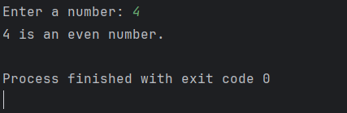

# Day 2 - Even or Odd

## 📖 Description

This is my **Day 2** program for the **100 Days of Python** challenge.

The program accepts a number from the user and determines whether it is **even** or **odd** using the modulus operator (`%`) and an `if-else` statement.

---

## 💻 Program

```python
# Day2 Even or Odd

num = int(input("Enter a number:"))

if num % 2 == 0 :
    print(f"{num} is an even number.")
else :
    print(f"{num} is an odd number.")
```

---

## ▶️ Sample Output



---

## 📚 Concepts Practiced

* Variables
* User Input
* Type Conversion (`int()`)
* Conditional Statements (`if-else`)
* Modulus Operator (`%`)
* Comparison Operator (`==`)
* f-Strings
* `print()` Function

---

## 🎯 What I Learned

* How to use the modulus operator (`%`) to determine whether a number is even or odd.
* How to make decisions in Python using `if` and `else`.
* How to accept user input and convert it to an integer.
* How to display output using Python f-strings.

---

**Challenge:** 100 Days of Python
**Day:** 2/100 ✅
