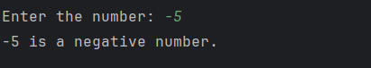

# Day 3 - Positive, Negative, or Zero

## 📖 Description

This is my **Day 3** program for the **100 Days of Python** challenge.

The program accepts a number from the user and determines whether it is **positive**, **negative**, or **zero** using `if`, `elif`, and `else` conditional statements.

---

## 💻 Program

```python
# Day 3 - Positive, Negative, or Zero

num = int(input("Enter the number: "))

if num > 0:
    print(f"{num} is a positive number.")
elif num < 0:
    print(f"{num} is a negative number.")
else:
    print(f"{num} is zero.")
```

---

## ▶️ Sample Output



---

## 📚 Concepts Practiced

* Variables
* User Input
* Type Conversion (`int()`)
* Conditional Statements (`if`, `elif`, `else`)
* Comparison Operators (`>`, `<`)
* f-Strings
* `print()` Function

---

## 🎯 What I Learned

* How to use `if`, `elif`, and `else` to handle multiple conditions.
* How to compare numbers using comparison operators.
* How to determine whether a number is positive, negative, or zero.
* How to display formatted output using Python f-strings.

---

**Challenge:** 100 Days of Python
**Day:** 3/100 ✅
