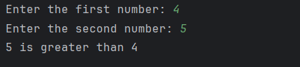

# Day 4 - Largest of Two Numbers

## 📖 Description

This is my **Day 4** program for the **100 Days of Python** challenge.

The program accepts two numbers from the user and determines which number is larger. If both numbers are equal, it displays an appropriate message.

---

## 💻 Program

```python
# Day 4 - Largest of Two Numbers

num1 = int(input("Enter the first number: "))
num2 = int(input("Enter the second number: "))

if num1 > num2:
    print(f"{num1} is greater than {num2}")
elif num2 > num1:
    print(f"{num2} is greater than {num1}")
else:
    print(f"{num1} is equal to {num2}")
```

---

## ▶️ Sample Output



---

## 📚 Concepts Practiced

* Variables
* User Input
* Type Conversion (`int()`)
* Conditional Statements (`if`, `elif`, `else`)
* Comparison Operators (`>`, `<`)
* f-Strings
* `print()` Function

---

## 🎯 What I Learned

* How to compare two numbers using conditional statements.
* How to use comparison operators to determine the larger value.
* How to handle multiple conditions, including equal values.
* How to display formatted output using Python f-strings.

---

**Challenge:** 100 Days of Python
**Day:** 4/100 ✅
