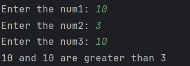

# Day 5 - Largest of Three Numbers

## 📖 Description

This is my **Day 5** program for the **100 Days of Python** challenge.

The program accepts three numbers from the user and determines the largest number. It also handles cases where two numbers are equal and are the largest, as well as the case where all three numbers are equal.

---

## 💻 Program

```python
# Day 5 - Largest of Three Numbers

num1 = int(input("Enter the num1: "))
num2 = int(input("Enter the num2: "))
num3 = int(input("Enter the num3: "))

if num1 > num2 and num1 > num3:
    print(f"{num1} is greater than {num2} and {num3}.")
elif num2 > num1 and num2 > num3:
    print(f"{num2} is greater than {num1} and {num3}.")
elif num3 > num1 and num3 > num2:
    print(f"{num3} is greater than {num1} and {num2}.")
elif num1 == num2 and num1 > num3:
    print(f"{num1} and {num2} are greater than {num3}.")
elif num1 == num3 and num1 > num2:
    print(f"{num1} and {num3} are greater than {num2}.")
elif num2 == num3 and num2 > num1:
    print(f"{num2} and {num3} are greater than {num1}.")
else:
    print("The three numbers are equal!")
```

---

## ▶️ Sample Output



---

## 📚 Concepts Practiced

* Variables
* User Input
* Type Conversion (`int()`)
* Conditional Statements (`if`, `elif`, `else`)
* Logical Operator (`and`)
* Comparison Operators (`>`, `==`)
* f-Strings
* `print()` Function

---

## 🎯 What I Learned

* How to compare three numbers using conditional statements.
* How to use the logical `and` operator to evaluate multiple conditions.
* How to handle edge cases where two or more numbers are equal.
* How to display formatted output using Python f-strings.

---

**Challenge:** 100 Days of Python
**Day:** 5/100 ✅
