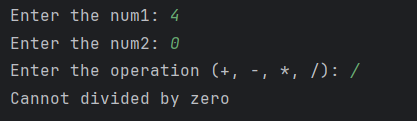

# Day 6 - Simple Calculator

## 📖 Description

This is my **Day 6** program for the **100 Days of Python** challenge.

The program accepts two numbers and an arithmetic operator from the user, performs the selected operation, and displays the result. It also handles division by zero and invalid operator inputs.

---

## 💻 Program

```python
# Day 6 - Simple Calculator

num1 = int(input("Enter the num1: "))
num2 = int(input("Enter the num2: "))

choice = input("Enter the operation (+, -, *, /): ")

if choice == "+":
    result = num1 + num2
    print(f"{num1} + {num2} = {result}")
elif choice == "*":
    result = num1 * num2
    print(f"{num1} * {num2} = {result}")
elif choice == "-":
    result = num1 - num2
    print(f"{num1} - {num2} = {result}")
elif choice == "/":
    if num2 != 0:
        result = num1 / num2
        print(f"{num1} / {num2} = {result}")
    else:
        print("Cannot divide by zero")
else:
    print("The operation choice entered is invalid.")
```

---

## ▶️ Sample Output



---

## 📚 Concepts Practiced

* Variables
* User Input
* Type Conversion (`int()`)
* Conditional Statements (`if`, `elif`, `else`)
* Nested `if` Statement
* Arithmetic Operators (`+`, `-`, `*`, `/`)
* Comparison Operator (`!=`)
* f-Strings
* `print()` Function

---

## 🎯 What I Learned

* How to perform different arithmetic operations based on user input.
* How to use nested `if` statements.
* How to validate division by zero before performing division.
* How to handle invalid operator inputs.
* How to display formatted output using Python f-strings.

---

**Challenge:** 100 Days of Python
**Day:** 6/100 ✅
