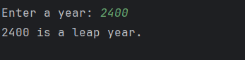

# Day 7 - Leap Year Checker

## 📖 Description

This is my **Day 7** program for the **100 Days of Python** challenge.

The program accepts a year from the user and determines whether it is a **leap year** or **not a leap year** based on the leap year rules.

---

## 💻 Program

```python
# Day 7 - Leap Year Checker

year = int(input("Enter a year: "))

if year % 400 == 0:
    print(f"{year} is a leap year.")
elif year % 100 != 0 and year % 4 == 0:
    print(f"{year} is a leap year.")
else:
    print(f"{year} is not a leap year.")
```

---

## ▶️ Sample Output



---

## 📚 Concepts Practiced

* Variables
* User Input
* Type Conversion (`int()`)
* Conditional Statements (`if`, `elif`, `else`)
* Modulus Operator (`%`)
* Logical Operator (`and`)
* Comparison Operator (`!=`)
* f-Strings
* `print()` Function

---

## 🎯 What I Learned

* How to determine whether a year is a leap year.
* How to use the modulus operator (`%`) to check divisibility.
* How to combine multiple conditions using the `and` operator.
* How to handle different conditions using `if`, `elif`, and `else`.
* How to apply logical conditions to solve a real-world programming problem.

---

**Challenge:** 100 Days of Python
**Day:** 7/100 ✅
