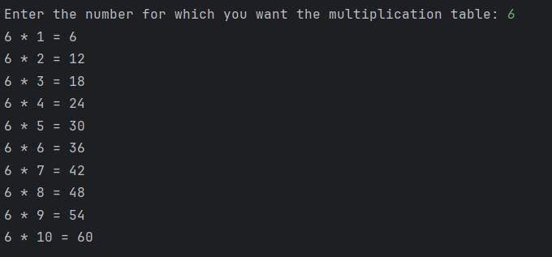

# Day 8 - Multiplication Table

## 📖 Description

This is my **Day 8** program for the **100 Days of Python** challenge.

The program accepts a number from the user and prints its multiplication table from **1 to 10** using a `for` loop.

---

## 💻 Program

```python
# Day 8 - Multiplication Table

num = int(input("Enter the number for which you want the multiplication table: "))

for i in range(1, 11):
    result = num * i
    print(f"{num} * {i} = {result}")
```

---

## ▶️ Sample Output



---

## 📚 Concepts Practiced

* Variables
* User Input
* Type Conversion (`int()`)
* `for` Loop
* `range()` Function
* Arithmetic Operator (`*`)
* f-Strings
* `print()` Function

---

## 🎯 What I Learned

* How to use a `for` loop to repeat a block of code.
* How to use the `range()` function to generate a sequence of numbers.
* How to perform repeated multiplication using a loop.
* How to display formatted output using Python f-strings.

---

**Challenge:** 100 Days of Python
**Day:** 8/100 ✅
