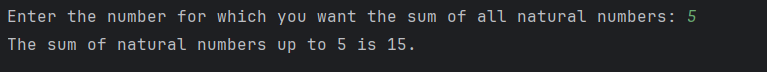

# Day 9 - Sum of Natural Numbers

## 📖 Description

This is my **Day 9** program for the **100 Days of Python** challenge.

The program accepts a positive integer from the user and calculates the sum of all natural numbers from **1 up to the given number** using a `for` loop.

---

## 💻 Program

```python
# Day 9 - Sum of Natural Numbers

num = int(input("Enter the number for which you want the sum of all natural numbers: "))

result = 0

for n in range(1, num + 1):
    result += n

print(f"The sum of natural numbers up to {num} is {result}.")
```

---

## ▶️ Sample Output



---

## 📚 Concepts Practiced

* Variables
* User Input
* Type Conversion (`int()`)
* `for` Loop
* `range()` Function
* Accumulator Variable
* Arithmetic Operator (`+`)
* Assignment Operator (`+=`)
* f-Strings
* `print()` Function

---

## 🎯 What I Learned

* How to use a `for` loop to iterate through a sequence of numbers.
* How to use `range()` to generate numbers from 1 up to a given value.
* How to use an accumulator variable to calculate a running total.
* How to use the `+=` operator to update a variable.
* How to display the final result using an f-string.

---

**Challenge:** 100 Days of Python
**Day:** 9/100 ✅
