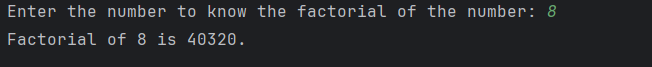

# Day 10 - Factorial of a Number

## 📖 Description

This is my **Day 10** program for the **100 Days of Python** challenge.

The program accepts a number from the user and calculates its factorial using a `for` loop. It also handles negative numbers, for which factorial is not defined.

---

## 💻 Program

```python
# Day 10 - Factorial of a Number

num = int(input("Enter the number to know the factorial of the number: "))

result = 1

if num < 0:
    print(f"{num} is a negative number, so factorial is not defined.")
else:
    for i in range(num, 0, -1):
        result *= i
    print(f"Factorial of {num} is {result}.")
```

---

## ▶️ Sample Output



---

## 📚 Concepts Practiced

* Variables
* User Input
* Type Conversion (`int()`)
* Conditional Statements (`if`, `else`)
* `for` Loop
* `range()` Function
* Accumulator Variable
* Multiplication Operator (`*`)
* Assignment Operator (`*=`)
* f-Strings
* `print()` Function

---

## 🎯 What I Learned

* How to calculate the factorial of a number using a loop.
* How to use an accumulator variable for multiplication.
* How to use `range()` with a decreasing sequence.
* How to handle negative numbers using conditional statements.
* How the factorial of `0` is correctly calculated as `1`.

---

**Challenge:** 100 Days of Python
**Day:** 10/100 ✅
