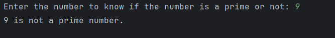

# Day 11 - Prime Number Checker

## 📖 Description

This is my **Day 11** program for the **100 Days of Python** challenge.

The program accepts a number from the user and determines whether it is a **prime number** or **not a prime number**.

A prime number is a number greater than 1 that has no divisors other than 1 and itself.

---

## 💻 Program

```python
# Day 11 - Prime Number Checker

num = int(input("Enter the number to know if the number is a prime or not: "))

is_prime = True

if num <= 1:
    is_prime = False
else:
    for n in range(2, num):
        if num % n == 0:
            is_prime = False

if is_prime:
    print(f"{num} is a prime number.")
else:
    print(f"{num} is not a prime number.")
```

---

## ▶️ Sample Output



---

## 📚 Concepts Practiced

* Variables
* User Input
* Type Conversion (`int()`)
* Conditional Statements (`if`, `else`)
* `for` Loop
* `range()` Function
* Modulus Operator (`%`)
* Boolean / Flag Variable
* Comparison Operators
* `break` concept
* f-Strings
* `print()` Function

---

## 🎯 What I Learned

* How to determine whether a number is prime.
* How to check whether a number has any divisor other than 1 and itself.
* How to use the modulus operator to check divisibility.
* How to use a Boolean flag variable to keep track of a condition.
* How to handle special cases such as `0`, `1`, and negative numbers.
* How a loop can be used to test multiple possible divisors.

---

**Challenge:** 100 Days of Python
**Day:** 11/100 ✅
