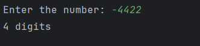

# Day 12 - Count the Digits

## 📖 Description

This is my **Day 12** program for the **100 Days of Python** challenge.

The program accepts an integer from the user and counts the total number of digits using a `while` loop.

The program also handles **zero and negative numbers**.

---

## 💻 Program

```python
# Day 12 - Count the Digits

a = int(input("Enter the number: "))

num = abs(a)

digit = 0

if num == 0:
    print("1 digit")
else:
    while num > 0:
        b = num // 10
        digit += 1
        num = b
    print(f"{digit} digits")
```

---

## ▶️ Sample Output



---

## 📚 Concepts Practiced

* Variables
* User Input
* Type Conversion (`int()`)
* `abs()` Function
* `while` Loop
* Integer Division (`//`)
* Counter Variable
* Conditional Statements (`if`, `else`)
* f-Strings
* `print()` Function

---

## 🎯 What I Learned

* How to count the digits of an integer using a `while` loop.
* How integer division by `10` removes the last digit of a number.
* How to use a counter variable to keep track of the number of digits.
* How to use `abs()` to handle negative numbers.
* How to handle `0` as a special case.
* How to repeatedly modify a variable inside a loop until a condition becomes false.

---

**Challenge:** 100 Days of Python
**Day:** 12/100 ✅
