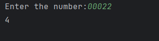

# Day 13 - Sum of Digits

## 📖 Description

This is my **Day 13** program for the **100 Days of Python** challenge.

The program accepts an integer from the user and calculates the sum of all its digits using a `while` loop.

The program also handles negative numbers by using the `abs()` function.

---

## 💻 Program

```python
# Day 13 - Sum of Digits

a = int(input("Enter the number: "))

num = abs(a)
b = 0

while num != 0:
    digit = num % 10
    b += digit
    num = num // 10

print(b)
```

---

## ▶️ Sample Output



---

## 📚 Concepts Practiced

* Variables
* User Input
* Type Conversion (`int()`)
* `abs()` Function
* `while` Loop
* Modulus Operator (`%`)
* Integer Division (`//`)
* Accumulator Variable
* Assignment Operator (`+=`)
* f-Strings
* `print()` Function

---

## 🎯 What I Learned

* How to extract the last digit of a number using the modulus operator.
* How to remove the last digit using integer division.
* How to process a number digit by digit using a `while` loop.
* How to use an accumulator variable to calculate a running sum.
* How to handle negative numbers using `abs()`.
* How to handle `0` correctly.

### Digit Processing Technique

```text
num % 10  → Extract the last digit
num // 10 → Remove the last digit
```

---

**Challenge:** 100 Days of Python
**Day:** 13/100 ✅
