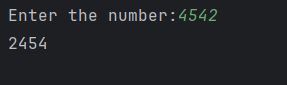

# Day 14 - Reverse a Number

## 📖 Description

This is my **Day 14** program for the **100 Days of Python** challenge.

The program accepts an integer from the user and reverses the digits of the number without converting the number into a string.

The program also handles positive numbers, negative numbers, and zero.

---

## 💻 Program

```python
# Day 14 - Reverse a Number

a = int(input("Enter the number:"))

num = abs(a)

result = 0

while num != 0:
    digit = num % 10
    result = digit + result * 10
    num = num // 10

if a < 0:
    result = -result
    print(result)
elif a > 0:
    print(result)
else:
    print(0)
```

---

## ▶️ Sample Output



---

## 📚 Concepts Practiced

* Variables
* User Input
* Type Conversion (`int()`)
* `abs()` Function
* `while` Loop
* Modulus Operator (`%`)
* Integer Division (`//`)
* Arithmetic Operators
* Conditional Statements
* Building a Number Digit by Digit
* f-Strings
* `print()` Function

---

## 🎯 What I Learned

* How to extract the last digit of a number using `% 10`.
* How to remove the last digit using `// 10`.
* How to build a reversed number digit by digit.
* How to use `result * 10` to shift existing digits to the left.
* How to handle negative numbers using the original input.
* How to handle zero as a special case.
* How to reverse a number without converting it to a string.

---

## 🔑 Important Technique

```python
digit = num % 10
num = num // 10
result = digit + result * 10
```

These operations allow the program to process and reverse the digits of a number.

---

**Challenge:** 100 Days of Python
**Day:** 14/100 ✅
