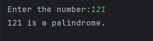

# Day 15 - Palindrome Number Checker

## 📖 Description

This is my **Day 15** program for the **100 Days of Python** challenge.

The program accepts an integer from the user and checks whether the number is a **palindrome** by reversing the number and comparing it with the original number.

A palindrome number remains the same when its digits are reversed.

---

## 💻 Program

    # Day 15 - Palindrome Number Checker

    num = abs(int(input("Enter the number:")))

    a = num

    result = 0

    while num != 0:
        digit = num % 10
        result = digit + result * 10
        num = num // 10

    if a == result:
        print(f"{a} is a palindrome.")
    else:
        print(f"{a} is not a palindrome.")

---

## ▶️ Sample Output

---

## 📚 Concepts Practiced

- Variables
- User Input
- Type Conversion (`int()`)
- `abs()` Function
- `while` Loop
- Modulus Operator (`%`)
- Integer Division (`//`)
- Conditional Statements (`if`, `else`)
- Comparison Operators
- Number Reversal
- f-Strings
- `print()` Function

---

## 🎯 What I Learned

- How to check whether a number is a palindrome.
- How to reverse a number using a `while` loop.
- How to extract the last digit using `% 10`.
- How to remove the last digit using `// 10`.
- How to preserve the original number before modifying it.
- How to compare the original number with its reversed value.
- How to reuse concepts learned in previous programs.

---

## 🔑 Important Technique

    digit = num % 10
    result = digit + result * 10
    num = num // 10

These operations allow the program to extract digits, construct the reversed number, and remove digits one by one.

---

**Challenge:** 100 Days of Python  
**Day:** 15/100 ✅