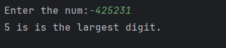

# Day 16 - Largest Digit

## 📖 Description

This is my **Day 16** program for the **100 Days of Python** challenge.

The program accepts an integer from the user and finds the largest digit present in that number.

The program uses a `while` loop to process the number digit by digit without converting it into a string.

---

## 💻 Program

    # Day 16 - Largest Digit

    num = abs(int(input("Enter the num:")))

    largest = 0

    while num != 0:
        digit = num % 10
        if digit > largest:
            largest = digit
        num = num // 10

    print(f"{largest} is the largest digit.")

---

## ▶️ Sample Output

---

## 📚 Concepts Practiced

- Variables
- User Input
- Type Conversion (`int()`)
- `abs()` Function
- `while` Loop
- Modulus Operator (`%`)
- Integer Division (`//`)
- Conditional Statements (`if`)
- Comparison Operators
- Counter / Tracking Variable
- f-Strings
- `print()` Function

---

## 🎯 What I Learned

- How to process a number digit by digit.
- How to extract the last digit using `% 10`.
- How to remove the last digit using `// 10`.
- How to track the largest value found during a loop.
- How to compare each digit with the current largest digit.
- How to handle negative numbers using `abs()`.
- How to handle `0` as a special case.
- How to solve a problem without converting the number into a string.

---

## 🔑 Important Technique

    digit = num % 10

    if digit > largest:
        largest = digit

    num = num // 10

This technique allows the program to examine every digit and keep track of the largest digit found.

---

**Challenge:** 100 Days of Python  
**Day:** 16/100 ✅