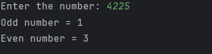

# Day 17 - Count Even and Odd Digits

## 📖 Description

This is my **Day 17** program for the **100 Days of Python** challenge.

The program accepts an integer from the user and counts how many **even digits** and **odd digits** are present in the number.

The program also handles zero and negative numbers.

---

## 💻 Program

    # Day 17 - Count Even and Odd Digits

    num = abs(int(input("Enter the number: ")))

    even = 0
    odd = 0

    if num == 0:
        even = 1
    else:
        while num > 0:
            digit = num % 10

            if digit % 2 == 0:
                even += 1
            else:
                odd += 1

            num = num // 10

    print(f"Odd number = {odd}")
    print(f"Even number = {even}")

---

## ▶️ Sample Output

---

## 📚 Concepts Practiced

- Variables
- User Input
- Type Conversion (`int()`)
- `abs()` Function
- `while` Loop
- Modulus Operator (`%`)
- Integer Division (`//`)
- Conditional Statements (`if`, `else`)
- Comparison Operators
- Counter Variables
- f-Strings
- `print()` Function

---

## 🎯 What I Learned

- How to process the digits of a number using a `while` loop.
- How to extract the last digit using `% 10`.
- How to remove the last digit using `// 10`.
- How to determine whether a digit is even or odd.
- How to use separate counter variables for different conditions.
- How to handle zero as a special case.
- How to handle negative numbers using `abs()`.

---

## 🔑 Important Technique

    digit = num % 10

    if digit % 2 == 0:
        even += 1
    else:
        odd += 1

    num = num // 10

This technique allows the program to process each digit individually.

---

**Challenge:** 100 Days of Python  
**Day:** 17/100 ✅