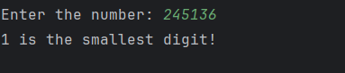

# Day 18 - Smallest Digit

## 📖 Description

This is my **Day 18** program for the **100 Days of Python** challenge.

The program accepts an integer from the user and finds the smallest digit present in the number.

The program also handles zero and negative numbers.

---

## 💻 Program

    # Day 18 - Smallest Digit

    num = abs(int(input("Enter the number: ")))

    smallest = 10

    if num == 0:
        smallest = 0
    else:
        while num != 0:
            digit = num % 10

            if smallest > digit:
                smallest = digit

            num = num // 10

    print(f"{smallest} is the smallest digit!")

---

## ▶️ Sample Output

---

## 📚 Concepts Practiced

- Variables
- User Input
- Type Conversion (`int()`)
- `abs()` Function
- `while` Loop
- Modulus Operator (`%`)
- Integer Division (`//`)
- Conditional Statements (`if`, `else`)
- Comparison Operators
- Finding Minimum Value
- Variable Tracking
- f-Strings
- `print()` Function

---

## 🎯 What I Learned

- How to process the digits of a number using a `while` loop.
- How to extract the last digit using `% 10`.
- How to remove the last digit using `// 10`.
- How to find the smallest digit by comparing each digit.
- How to initialize a variable with a suitable starting value.
- Why `10` can be used as the initial value when finding the smallest digit.
- How to handle zero as a special case.
- How to handle negative numbers using `abs()`.

---

## 🔑 Important Technique

    digit = num % 10

    if smallest > digit:
        smallest = digit

    num = num // 10

The program extracts each digit, compares it with the current smallest digit, and updates the value when a smaller digit is found.

---

**Challenge:** 100 Days of Python  
**Day:** 18/100 ✅