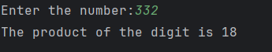

# Day 19 - Product of Digits

## 📖 Description

This is my **Day 19** program for the **100 Days of Python** challenge.

The program accepts an integer from the user and calculates the product of all the digits in the number.

The program also handles zero and negative numbers.

---

## 💻 Program

    # Day 19 - Product of Digits

    num = abs(int(input("Enter the number: ")))

    product = 1

    if num == 0:
        product = 0
    else:
        while num != 0:
            digit = num % 10
            product *= digit
            num = num // 10

    print(f"The product of the digits is {product}")

---

## ▶️ Sample Output

---

## 📚 Concepts Practiced

- Variables
- User Input
- Type Conversion (`int()`)
- `abs()` Function
- `while` Loop
- Modulus Operator (`%`)
- Integer Division (`//`)
- Conditional Statements (`if`, `else`)
- Multiplication
- Accumulator Variable
- Assignment Operator (`*=`)
- f-Strings
- `print()` Function

---

## 🎯 What I Learned

- How to process the digits of a number using a `while` loop.
- How to extract the last digit using `% 10`.
- How to remove the last digit using `// 10`.
- How to calculate the product of multiple digits.
- How to use an accumulator variable for multiplication.
- Why the product should initially be set to `1`.
- How to handle `0` as a special case.
- How to handle negative numbers using `abs()`.

---

## 🔑 Important Technique

    digit = num % 10
    product *= digit
    num = num // 10

The program extracts each digit, multiplies it with the current product, and then removes the digit from the number.

---

**Challenge:** 100 Days of Python  
**Day:** 19/100 ✅