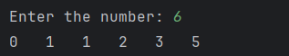

# Day 21 - Fibonacci Series

## 📖 Description

This is my **Day 21** program for the **100 Days of Python** challenge.

The program accepts a number from the user and prints the first `n` terms of the Fibonacci series.

The Fibonacci series starts with:

0, 1, 1, 2, 3, 5, 8, 13, 21, ...

Each number is calculated by adding the previous two numbers.

---

## 💻 Program

    # Day 21 - Fibonacci Series

    num = int(input("Enter the number: "))

    first_num = 0
    second_num = 1

    for i in range(num):
        print(first_num, end="\t")
        next = first_num + second_num
        first_num = second_num
        second_num = next

---

## ▶️ Sample Output

---

## 📚 Concepts Practiced

- Variables
- User Input
- Type Conversion (`int()`)
- `for` Loop
- `range()` Function
- Arithmetic Operators
- Addition
- Multiple Variables
- Updating Variables
- Sequence Generation
- f-Strings
- `print()` Function

---

## 🎯 What I Learned

- How the Fibonacci sequence is generated.
- How to use a `for` loop to generate a fixed number of terms.
- How to maintain the previous two values of a sequence.
- How to calculate the next Fibonacci number.
- How to update variables after every iteration.
- How variables can carry information from one loop iteration to the next.
- How to use `range()` to control the number of terms.

---

## 🔑 Important Technique

    next = first_num + second_num
    first_num = second_num
    second_num = next

These statements calculate the next Fibonacci number and update the two variables so that the sequence can continue.

---

**Challenge:** 100 Days of Python  
**Day:** 21/100 ✅