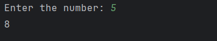

# Day 22 - Nth Fibonacci Term

## 📖 Description

This is my **Day 22** program for the **100 Days of Python** challenge.

The program accepts a number `n` from the user and finds the **nth term of the Fibonacci sequence** using 0-based indexing.

The Fibonacci sequence is:

0, 1, 1, 2, 3, 5, 8, 13, 21, ...

For example:

F(0) = 0

F(1) = 1

F(2) = 1

F(3) = 2

F(4) = 3

F(5) = 5

---

## 💻 Program

    # Day 22 - Nth Fibonacci Term

    num = int(input("Enter the number: "))

    if num == 0:
        second_num = 0
    else:
        first_num = 0
        second_num = 1

        for i in range(num):
            next_num = first_num + second_num
            first_num = second_num
            second_num = next_num

    print(second_num)

---

## ▶️ Sample Output

---

## 📚 Concepts Practiced

- Variables
- User Input
- Type Conversion (`int()`)
- `for` Loop
- `range()` Function
- Fibonacci Sequence
- Arithmetic Operators
- Variable Updating
- State Tracking
- Conditional Statements
- Multiple Variables
- `print()` Function

---

## 🎯 What I Learned

- How to find a specific term in the Fibonacci sequence.
- How Fibonacci numbers are generated using the previous two values.
- How to update variables inside a loop.
- How to maintain the state of a sequence between iterations.
- How to use 0-based indexing for Fibonacci terms.
- How to handle the special case when `n = 0`.
- How to solve the problem without using recursion or a list.

---

## 🔑 Important Technique

    next_num = first_num + second_num
    first_num = second_num
    second_num = next_num

These statements calculate the next Fibonacci number and update the two variables so that the sequence can continue.

---

**Challenge:** 100 Days of Python  
**Day:** 22/100 ✅