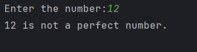

# Day 23 - Perfect Number

## 📖 Description

This is my **Day 23** program for the **100 Days of Python** challenge.

The program accepts an integer from the user and checks whether it is a **Perfect Number**.

A perfect number is a positive number whose proper divisors add up exactly to the number itself.

For example:

6 → 1 + 2 + 3 = 6

Therefore, 6 is a perfect number.

Another example:

28 → 1 + 2 + 4 + 7 + 14 = 28

Therefore, 28 is also a perfect number.

---

## 💻 Program

    # Day 23 - Perfect Number

    num = abs(int(input("Enter the number:")))
    a = num

    divisor = 0

    for i in range(1, num):
        if a % i == 0:
            divisor += i

    if divisor == num:
        print(f"{num} is a perfect number.")
    else:
        print(f"{num} is not a perfect number.")

---

## ▶️ Sample Output

---

## 📚 Concepts Practiced

- Variables
- User Input
- Type Conversion (`int()`)
- `abs()` Function
- `for` Loop
- `range()` Function
- Modulus Operator (`%`)
- Divisibility
- Conditional Statements (`if`, `else`)
- Comparison Operators
- Accumulator Variables
- Finding Divisors
- Addition
- f-Strings
- `print()` Function

---

## 🎯 What I Learned

- What a perfect number is.
- How to find the proper divisors of a number.
- How to check whether one number divides another using `%`.
- How to use a `for` loop to check possible divisors.
- How to add all valid divisors using an accumulator.
- How to compare the sum of the divisors with the original number.
- How to solve the problem without using built-in divisor functions.

---

## 🔑 Important Technique

    for i in range(1, num):
        if num % i == 0:
            divisor += i

This checks every number smaller than the input and adds it to the divisor sum if it divides the input exactly.

---

**Challenge:** 100 Days of Python  
**Day:** 23/100 ✅