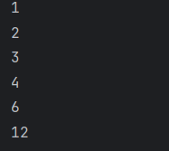

# Day 24 - Find All Factors

## 📖 Description

This is my **Day 24** program for the **100 Days of Python** challenge.

The program accepts an integer from the user and finds and prints all the factors of that number.

A factor is a number that divides another number exactly without leaving a remainder.

For example, the factors of 12 are:

1, 2, 3, 4, 6, 12

---

## 💻 Program

    # Day 24 - Find All Factors

    num = abs(int(input("Enter the number: ")))

    for i in range(1, num + 1):
        if num % i == 0:
            print(i)

---

## ▶️ Sample Output

---

## 📚 Concepts Practiced

- Variables
- User Input
- Type Conversion (`int()`)
- `abs()` Function
- `for` Loop
- `range()` Function
- Modulus Operator (`%`)
- Divisibility
- Conditional Statements (`if`)
- Comparison Operators
- `print()` Function

---

## 🎯 What I Learned

- What factors of a number are.
- How to find factors using a `for` loop.
- How to check divisibility using the modulus operator (`%`).
- How to use `range()` to check every possible factor.
- How to print a number when it divides the input exactly.
- How to reuse the divisor-checking logic from previous problems.

---

## 🔑 Important Technique

    for i in range(1, num + 1):
        if num % i == 0:
            print(i)

The loop checks every number from `1` to the input number and prints the numbers that divide the input without a remainder.

---

**Challenge:** 100 Days of Python  
**Day:** 24/100 ✅