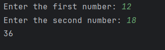

# 📅 Day 26 – LCM of Two Numbers

## 📌 Problem Statement

Write a Python program to find the **Least Common Multiple (LCM)** of two numbers.

The LCM of two numbers is the **smallest positive number that is divisible by both numbers**.

### Examples

* LCM of `12` and `18` → `36`
* LCM of `4` and `6` → `12`
* LCM of `7` and `3` → `21`

For this exercise, if either number is `0`, the program returns `0`.

---

## 🎯 Concepts Practiced

* `for` loops
* Modulo operator `%`
* Conditional statements
* Common multiples
* `break` statement
* Edge case handling
* Basic problem-solving logic

---

## 💻 Program

```
num1 = int(input("Enter the first number: "))
num2 = int(input("Enter the second number: "))
divisor = 0

if num1 == 0 or num2 == 0:
    divisor = 0
else:
    for i in range(1, num1 * num2 + 1):
        if i % num1 == 0 and i % num2 == 0:
            divisor = i
            break

print(divisor)
```

---

## 🧠 How It Works

1. Take two numbers as input.
2. Check whether either number is `0`.
3. If either number is `0`, set the LCM to `0`.
4. Otherwise, start checking possible common multiples from `1`.
5. Check if the current number is divisible by both input numbers using `%`.
6. When the first common multiple is found, store it in `divisor`.
7. Use `break` to stop the loop because the first common multiple is the smallest one.
8. Print the LCM.

---

## 🔍 Example

### Input

```
Enter the first number: 12
Enter the second number: 18
```

### Output

```
36
```

### Explanation

Multiples of `12`:

```
12, 24, 36, 48, ...
```

Multiples of `18`:

```
18, 36, 54, ...
```

The first common multiple is `36`.

Therefore:

```
LCM = 36
```

---

## ⚠️ Edge Cases

| Input    | Output |
| -------- | -----: |
| `12, 18` |   `36` |
| `4, 6`   |   `12` |
| `7, 3`   |   `21` |
| `5, 5`   |    `5` |
| `0, 5`   |    `0` |
| `0, 0`   |    `0` |

---

## 📚 Key Learning

### GCD vs LCM

**GCD** finds the largest number that **divides both numbers**.

**LCM** finds the smallest number that is **divisible by both numbers**.

For example:

```
GCD(12, 18) = 6
LCM(12, 18) = 36
```

The important difference is:

```
GCD → num1 % i == 0
LCM → i % num1 == 0
```

---

## 🖼️ Output

The program was executed with different test cases to verify the LCM calculation and edge-case handling.

Example output:

```
Enter the first number: 12
Enter the second number: 18
36
```

The screenshot of the program execution is included below:



---

## 🚀 Challenge Progress

**Day 26 of 100 Days of Python – Completed ✅**

Previous: [Day 25 – GCD of Two Numbers](../Day25_GCD/)

Next: **Day 27 – Coming Soon...**
