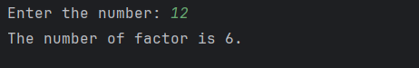

# Day 27 - Count the Number of Factors

## 📖 Description

This is my **Day 27** program for the **100 Days of Python** challenge.

The program accepts an integer from the user and counts the total number of factors of that number.

A factor is a number that divides another number exactly without leaving a remainder.

For example, the factors of 12 are:

1, 2, 3, 4, 6, 12

Therefore:

The number of factors = 6

---

## 💻 Program

```
# Day 27 - Count the Number of Factors

num = abs(int(input("Enter the number: ")))

factor = 0

if num == 0:
    factor = 0
else:
    for i in range(1, num + 1):
        if num % i == 0:
            factor += 1

print(f"The number of factors is {factor}.")
```

---

## ▶️ Sample Output



---

## 📚 Concepts Practiced

* Variables
* User Input
* Type Conversion (`int()`)
* `abs()` Function
* `for` Loop
* `range()` Function
* Modulus Operator (`%`)
* Divisibility
* Conditional Statements
* `if` and `else`
* Comparison Operators
* Incrementing a Counter
* Counting
* f-Strings
* `print()` Function

---

## 🎯 What I Learned

* How to count the total number of factors of a number.
* How to check whether a number is a factor using the modulus operator (`%`).
* How to use a counter variable to count valid factors.
* How to use a `for` loop to check every possible factor.
* How to increment a counter using `+= 1`.
* How to handle zero as an input.
* How to reuse the factor-checking logic from Day 24.

---

## 🔑 Important Technique

```
factor = 0

for i in range(1, num + 1):
    if num % i == 0:
        factor += 1
```

The variable `factor` keeps track of how many numbers divide the input number exactly.

Whenever a factor is found, the counter is increased by `1`.

---

**Challenge:** 100 Days of Python
**Day:** 27/100 ✅
